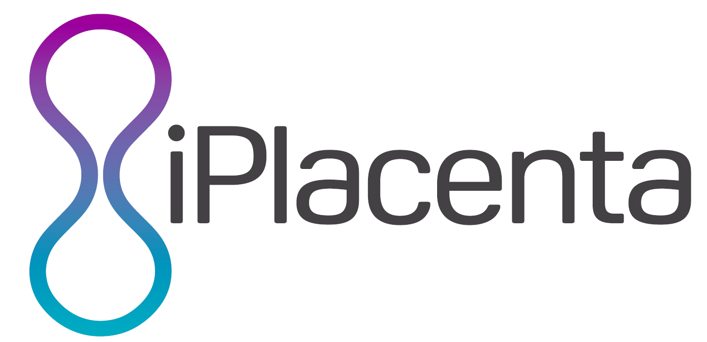

<div id="top"></div>

<p align="left">
  
  <span>&nbsp;</span>
  
</p>
<br/>

# Introduction to Galaxy and Python with Jupyter Notebook

Life sciences used to be all about wet-lab expertise. Due to fast technical
innovations and digitalisation we are now facing the challenge of dealing with
vasts amounts of data. Analyses of such data requires advanced statistics and
specialized tools to run analyses and to visualize both data and results.
Science becomes more and more dependent on bioinformaticians and computer
scientists, which creates the additional challenge of interdisciplinary
communication.  
This course introduces the [Galaxy framework](https://usegalaxy.eu), an open
source, web-based platform for data intensive biomedical research, [Python](https://www.python.org),
an interpreted, high-level, general-purpose programming language, and
[Jupyter Notebook](https://jupyter.org/), a multi-language framework for
interactive computing.  

You can chose to use this course as a stepping stone into advanced analyses,
or as an opportunity to learn what your bioinformatician of trust is actually
doing.  
Further courses and tutorials for Galaxy and Python are widely available. Both
Galaxy and Python have active user communities, making self-paced learning
possible.

- [Learning goals](#learning-goals)
- [Prerequisites](#prerequisites)
- [Tools](#tools)
- [Schedule](#schedule)
  - [Session 1](#session-1---introduction-to-galaxy)
  - [Session 2](#session-2---python-and-jupyter-notebook)
  - [Session 3](#session-3---conclusion)
- [Tutors](#tutors)
- [Useful links and tips](#useful-links-and-tips)
  - [Galaxy and QC](#galaxy-and-qc)
  - [Run Galaxy as a Docker container](#run-galaxy-as-a-docker-container)
  - [Python resources](#python-resources)
  - [How to obtain FASTQ files from SRA entries](#how-to-obtain-fastq-files-from-sra-entries)


## Learning goals

- Know your data: implications of quality control and data preprocessing
- Hands-on quality control and data preprocessing
- Understanding and programming in Python
- Hands-on session with Jupyter Notebooks.
<p align="right"><a href="#top">&#x25B2; back to top</a></p>


## Prerequisites

This workshop is intended for PhD students with a background in medicine,
engineering and life science research.  
In order to take part in the hands-on session we recommend one Laptop/PC and a
stable internet connection.  
We further ask you to create a [Galaxy account](https://usegalaxy.eu/login)
beforehand.  

_Please let us know if you have issues setting up your accounts, before the
beginning of session 1._
<p align="right"><a href="#top">&#x25B2; back to top</a></p>


## Tools

**Galaxy**: Galaxy is a scientific workflow management system, data
integration, and data analysis platform that aims to make computational biology
accessible to research scientists that do not have extended computer
programming experience.  
Galaxy was initially developed for genomics research and grew into a framework
for biomedical data analysis. It's intended use supports the accessibility,
reproducibility and trasparency of research.  

**Python**: Python is a high-level, general-purpose programming language. It's
syntax emphasizes code readability and supports the use of clear and logically
written algorithms.  
Applications of Python transcends life sciences and are used by large
organizations, such as Wikipedia, Google, NASA, Spotify and many more.  

**Jupyter Notebooks**: a multi-language platform for interactive computing.
Notebook documents are both human-readable documents containing the analysis
description and the results (including figures and tables) as well as
executable documents which can be run to perform data analysis.
<p align="right"><a href="#top">&#x25B2; back to top</a></p>


## Schedule

### Session 1 - Introduction to Galaxy

Meeting: [Zoom Session 1](https://uni-rostock-de.zoom.us/j/7990949900?pwd=Vm1ZWDNsMjJKeU9uRlV6OTdFTG9nUT09)
Time and Date: 15:00 - 16:30 CEST, 13.07.2020

| **Time slot** | **Topic** | **Lead** |
| :---: | :--- | :---: |
||||
| 20 min | Welcome | all |
| 30 min | Introduction to Galaxy ([slides](https://galaxyproject.github.io/training-material/topics/introduction/slides/introduction.html#1)) and Quality Control ([slides](https://galaxyproject.github.io/training-material/topics/sequence-analysis/tutorials/quality-control/slides.html#1)) | Andrea Bagnacani |
| 30 min | Exercise demo: Quality control and data preprocessing with Galaxy ([hands-on](https://galaxyproject.github.io/training-material/topics/sequence-analysis/tutorials/quality-control/tutorial.html)) | Andrea Bagnacani |

Your turn! Try and recreate the exercise on your own. No worries, we are
available for support.  
We will review the challenges during the next session, so we are all on the
same track.  
Find the step by step tutorial and required data [here](https://galaxyproject.github.io/training-material/topics/introduction/tutorials/galaxy-intro-short/tutorial.html).
<p align="right"><a href="#top">&#x25B2; back to top</a></p>


### Session 2 - Python and Jupyter Notebook

Meeting: [Zoom Session 2](https://uni-rostock-de.zoom.us/j/99281225131?pwd=R1pBUWlyRkQxTWQxVE5QOHdsaDhuQT09)
Time and Date: 14:00 - 15:30 CEST, 15.07.2020`

| **Time slot** | **Topic** | **Lead** |
| :---: | :--- | :---: |
||||
| 30 min | Exercise review and [feedback](https://de.surveymonkey.com/r/denbi-course?sc=rbc&id=000267) | all |
| 15 min | Recap Galaxy | Andrea Bagnacani |
| 60 min | Introduction Python and Jupyter Notebook | Julia Scheel |

Go for it. Follow the exercises and show us your plots next time.  
As always, we are available for support. We will review the challenges during
the next session.  
Find the step by step tutorial and required data [here](https://github.com/JuliaScheel/Templates-iPlacenta/blob/master/iPlacenta_jupyter_notebook_blank.pdf) in pdf and [here](https://github.com/JuliaScheel/Templates-iPlacenta/blob/master/iPlacenta_blank.ipynb) as a jupyter notebook.

To save the jupyter notebook correctly please click on "Raw", then press "ctrl+s", then manually add ".ipynb" to the file. Please be aware, should you not add it manually the file will be saved as a .txt (and will be called "iPlacenta_blank.ipynb.txt")

The data can be found [here](https://github.com/JuliaScheel/Templates-iPlacenta/tree/master/data). Please download the files just like before and add ".csv". You will also receive the files by e-mail.

<p align="right"><a href="#top">&#x25B2; back to top</a></p>


### Session 3 - Conclusion

Meeting: [Zoom Session 3](https://uni-rostock-de.zoom.us/j/95527560605?pwd=QnpRdXY5ZStKYWlnQnAwRGdIdlRZUT09)
Time and Date: 15:00 - 16:30 CEST, 27.07.2020

| **Time slot** | **Topic** | **Lead** |
| :---: | :--- | :---: |
||||
| 30 min | Review Python exercise | all |
| 15 min | Recap |  all |
| 30 min | Q&A and feedback | all |
<p align="right"><a href="#top">&#x25B2; back to top</a></p>


## Feedback
Please provide feedback here https://www.surveymonkey.de/r/JBV7KP8

## Tutors

- [Andrea Bagnacani](https://www.sbi.uni-rostock.de/team/detail/andrea-bagnacani)
- [Julia Scheel](https://www.sbi.uni-rostock.de/team/detail/julia-scheel)
- [Markus Wolfien](https://www.sbi.uni-rostock.de/team/detail/markus-wolfien)
<p align="right"><a href="#top">&#x25B2; back to top</a></p>


## Useful Links and Tips


### Galaxy and QC

- Our Galaxy instance of reference: [usegalaxy.eu](https://usegalaxy.eu)
- Where to [create an account](https://usegalaxy.eu/login)
- The [Galaxy training material](https://galaxyproject.github.io/training-material/)
- The [Galaxy Tool Shed](https://toolshed.g2.bx.psu.edu/)
- [Galaxy flavors](https://github.com/bgruening/docker-galaxy-stable#list-of-galaxy-flavours--toc)!
- [Zenodo](https://zenodo.org/)
- QC Fail: [articles about common NGS QC problems](https://sequencing.qcfail.com)
- Further [de.NBI training opportunities](https://www.denbi.de/training)
<p align="right"><a href="#top">&#x25B2; back to top</a></p>


### Run Galaxy as a Docker container

Galaxy can run on your machine. To do so, you need [Docker](https://www.docker.com/), which can be
installed in different ways depending on the underlying system:
- Unix users should follow the
[Docker installation for Linux](https://docs.docker.com/installation)
- MacOS 10.12+ users should follow the
[Docker installation for Mac](https://hub.docker.com/editions/community/docker-ce-desktop-mac)
- Windows 10+ users, should follow the
[Docker installation for Windows](https://hub.docker.com/editions/community/docker-ce-desktop-windows)
- Non-unix users, whose operative system version is older than the
aforementioned one, can rely on [Kitematic](https://kitematic.com/)

Once Docker is set, you can run the container.

Galaxy exists in [many flavors](https://github.com/bgruening/docker-galaxy-stable#list-of-galaxy-flavours--toc). Let's run the [RNA Workbench](https://github.com/bgruening/galaxy-rna-workbench): a Galaxy instance tailored for RNA analysis.

- Users not relying on Kitematic can open a terminal, or a Windows PowerShell, and type:
```
$ docker run -d -p 8080:80 quay.io/bgruening/galaxy-rna-workbench
```

- Kitematic users can launch the Galaxy instance by following [these instructions](https://docs.docker.com/kitematic/userguide/).

After running the container, the Galaxy instance can be accessed from the local
web browser, at the address ``localhost:8080``.  
We recommend using Google Chrome, Chromium, or Mozilla Firefox.
<p align="right"><a href="#top">&#x25B2; back to top</a></p>


### Python resources
- [Python](https://www.python.org/) documentation and community
- [The Carpentries](https://carpentries.org/) learning opportunities and community
- [Stack Overflow](https://stackoverflow.com/)
<p align="right"><a href="#top">&#x25B2; back to top</a></p>


### How to obtain FASTQ files from SRA entries

From an [SRA data list on NCBI](https://www.ncbi.nlm.nih.gov/sra?linkname=bioproject_sra_all&from_uid=316992)

- Select the files of interest
- Click ``Send to``
- Select ``File``
- Select ``Accession list``
- Click ``Create File``

You now have a textfile (SraAccList.txt) with a list of 29 SRA identifiers:
```
SRR3317120
SRR3317121
SRR3317122
...
```

Save it to a directory called ``/home/<user>/ncbi/public/sra``, or the next step won't work (you should configure the prefetch command otherwise)

You now have to loop through them to download the .sra files from Entrez, and convert them into FASTQ files.  
Using Bash:
```
$ while read srr; \
do prefetch -v "$srr"; \
fastq-dump --split-files --gzip "$l"; \
rm "$srr".sra ; \
done < SraAccList.txt
```
<p align="right"><a href="#top">&#x25B2; back to top</a></p>
