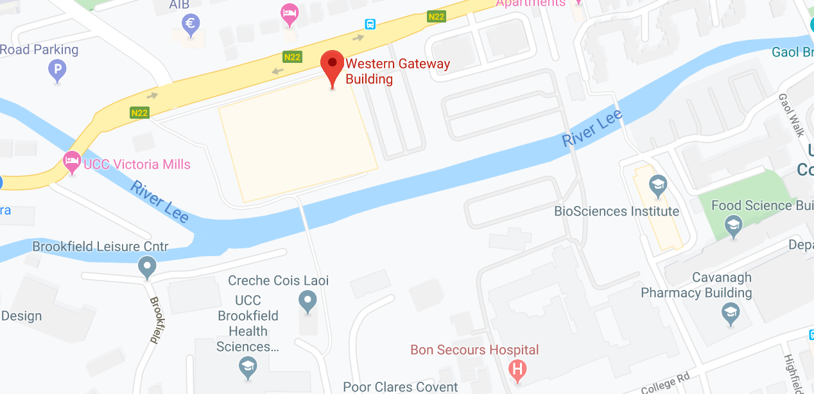
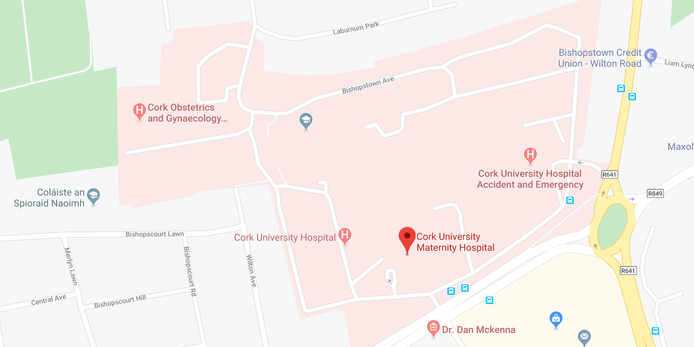

# PlacentOmics [Place holder]

The training course will introduce basic concepts of systems biology, network analysis, network visualisation and the [Galaxy framework](https://usegalaxy.org). 

Learning goals:
- Understand the motivation behind systems biology approaches
- Know basic systems biology terminologies
- Understand the systems biology workflow
- Calculate network topological parameters
- Find critical nodes in the network
- Identify the regulatory core from a large network
- Know your data, and the implications of data preprocessing and quality control
- Performing differential gene expression analysis using Galaxy
- Visualize a network

Prerequisites:
This workshop is intended for PhD students with a background in medicine, engineering and life science research. In order to take part in the hands-on session we recommend one Laptop/PC between two participants with internet access.

- [Schedule](#schedule)
  - [Day 1](#day-1---monday-6th-april)
  - [Day 2](#day-2---tuesday-7th-april)
  - [Day 2](#day-2---wednesday-8th-april)
- [Evening event](#evening-event)
- [Useful links](#useful-links)

 

<a href="#top">&#x25B2; back to top</a>

## Schedule

### Day 1 - Monday 6th April
### iPlacenta Network Meeting and ESR Presentations (Closed Event)
Venue: Aula Maxima
Address: 60 College Rd, University College, Cork, Ireland.   
  
  
| **Time slot** | **Topic** | **Tutor** |
| :---: | :------------------------------- | :---: |
||||
| 08:30 - 09:00 | Poster Set-up |  |
| 09:00 - 10:00 | Network Meeting | iPlacenta ESRs and PIs |
| 10:00 - 10:25 | 3 min ESR Presentations | ESRs 1 to 8 |
| 10:25 - 10:40 | Coffee break ||
| 10:40 - 11:05 | 3 min ESR Presentations| ESRs 9 to 15 |
| 11:05 - 11:30 | Poster Session | all ESRs |
| 11:30 - 12:00 | Supervisory Board Meeting ||
| 12:00 - 12:50 | Lunch ||  

### Work Package 2 Talks (Open Event)
Chair: Prof. Olaf Wolkenhauer and Dr. Colin Murdoch
Venue: Aula Maxima 

| **Time slot** | **Topic** | **Tutor** |
| :---: | :--- | :---: |
||||
| 13:00 - 13:30 | TBD | Dr. Daniel Vaiman |
| 13:30 - 14:00 | TBD | Prof. Leon de Windt|
| 14:00 - 14:30 | Imaging of the Placenta | Dr. Lisa Story|
| 14:30 - 15:00 | TBD | Dr. Jane English |
| 15:00 - 15:15 | Coffee break ||
| 15:15 - 15:45 | TBD | Prof. Olaf Wolkenhauer|
| 16:00 - 17:00 | Map Away - Systems Biology - Disease Mapping Group - Activity and Coffee ||

   

<a href="#top">&#x25B2; back to top</a>
  

### Day 2 - Tuesday 7th April
### Introduction to Systems Biology
Venue: Western Gateway Building
Address: University College Cork, Western Rd, Mardyke, Cork, Ireland.   
  

| **Time slot** | **Topic** | **Tutor** |
| :---: | :--- | :---: |
||||
| 08:30 - 09:15 | The systems biology approach | Dr. Shailendra Gupta |
| 09:15 - 10:15 | Network construction and analysis | Dr. Shailendra Gupta|
| 10:15 - 10:30 | Coffee Break ||
| 10:30 - 12:30 | Galaxy - gene expression analysis - hands on | Andrea Bagnacani |
| 12:30 - 13:15 | Lunch | |
| 13:15 - 13:30 | Walk to CUMH |  |

### Patient Interaction Session
Chair: Dr. Fergus McCarthy
Venue: Cork University Materny Hospital
Address: Wilton Rd, Wilton, Cork, Ireland.   
  

| **Time slot** | **Topic** | **Tutor** |
| :---: | :--- | :---: |
||||
| 13:40 - 14:20 | Pregnancy, birth, and 3  months in the NICO ... 10 years on | Bairbre O'Toole |
| 14:20 - 15:05 | Irish Nionatal Health Alliance  <ul><li>Family Centred Care</li><li>Bonding and Attachment in the NICU</li><li>The importance of sleepin the NICU</li></ul> | Mandy Daly  |
| 15:20 | Team Building Activity: Goalbreak | [Team Build Cork](https://corkcitygaol.com/) |
   

<a href="#top">&#x25B2; back to top</a>
 

### Day 3 - Wednesday 8th April
### UCC Talks (Open Session)
Chair: Dr. Jane English and Dr. Cathal McCarthy
Venue: Western Gateway Building
Address: University College Cork, Western Rd, Mardyke, Cork, Ireland.   

| **Time** | **Title** | **Facilitator** |
| :---: | :--- | :---: |
||||
| 08:30 - 09:00 | Biology of the Placenta | Ms Susan Dineen |
| 09:00 - 09:30 | Predicting Critical Illness and Outcome in Preterm Newborns using Automated Physiological Neurobell - Portable EEG Monitoring and Analysis | Dr. John O'Toole  |
| 09:30 - 10:00 | Neurobell - Portable EEG Monitoring and Analysis | Mark O'Sullivan  |
| 10:00 - 10:20 | Open Sciences and Its' Impact on Research| Ms Aoife Coffey |
| 10:20 - 10:40 | Coffee break| |
| 10:40 - 11:20 | Writing successful grant proposals| Dr. Ashleigh Byrne & Dr. Eoghan McKernan|
| 11:20 - 11:55 | Microbiome-Gut-Brain Axis During Pregnancy and Beyond| Dr. Siobhain O'Mahony|
| 11:55 - 12:25 | LUNCH| |
| 12:25 - 13:45 | Standards of network visualization and hands on| Tom Gebhardt|
   

<a href="#top">&#x25B2; back to top</a>
 

## Evening event

Amazing evening event in or around Cork

<a href="#top">&#x25B2; back to top</a>

## Useful links
- [Systems Biology as Defined by NIH](https://irp.nih.gov/catalyst/v19i6/systems-biology-as-defined-by-nih)
- [ Newt Editor ](http://web.newteditor.org/)
- [SBI Rostock Projects](https://www.sbi.uni-rostock.de/research/projects)
- [Systems Biology Encyclopedia](https://link.springer.com/referenceworkentry/10.1007/978-1-4419-9863-7_547#springerlink-search)
- [Galaxy training material](https://galaxyproject.github.io/training-material/): a collection of tutorials developed and maintained by the worldwide Galaxy community
- [QC FAIL](https://sequencing.qcfail.com/) : articles about common NGS problems
- [Correlation between DNA methylation and gene expression in the brains of patients with bipolar disorder and schizophrenia](https://doi.org/10.1111/bdi.12255)

<a href="#top">&#x25B2; back to top</a>

